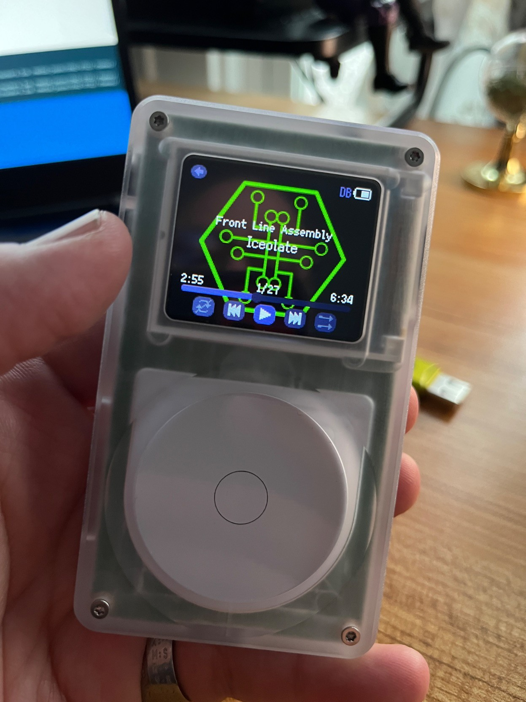

# tangara-skins
Skins for the [worlds coolest music player](https://cooltech.zone/tangara/)

Not a lot here so far, submissions/pull requests welcome!

## Usage

Copy the `.lua` file for the desired theme onto your SD card in a directory named `.themes` as described in [the docs](https://cooltech.zone/tangara/docs/themes/).

Copy the directory for the them to `.themes`.

> Note: Don't use the `example` theme here, it's bad.

This could be a lot slicker, and maybe eventually will, but not right now.
